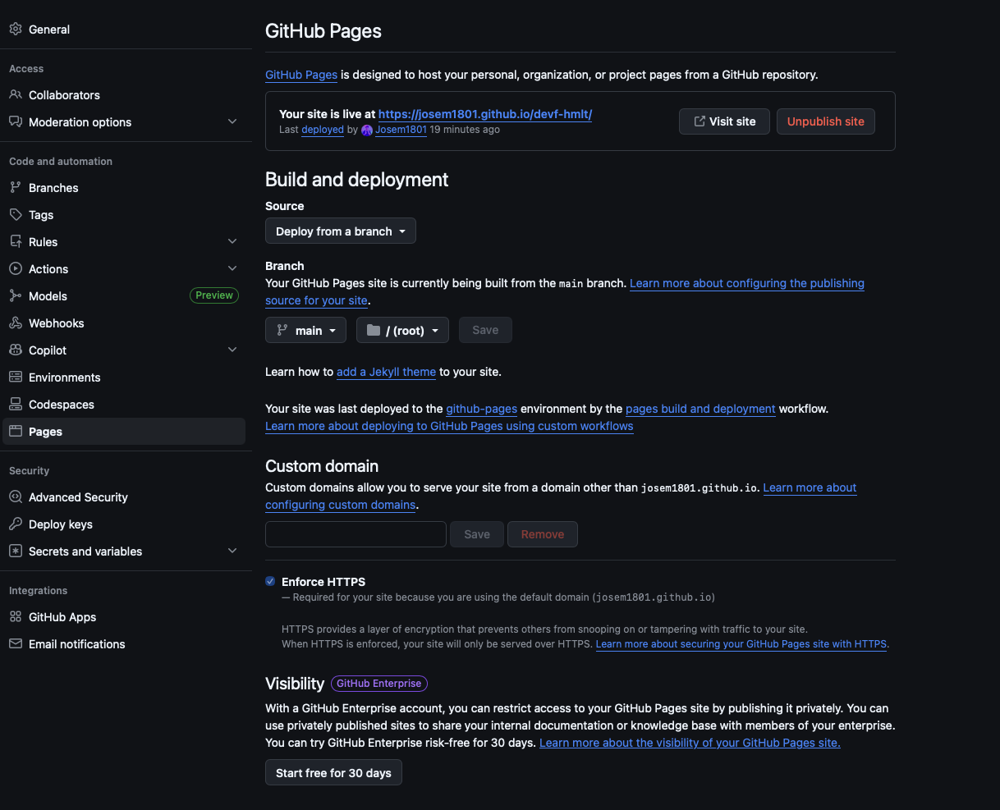
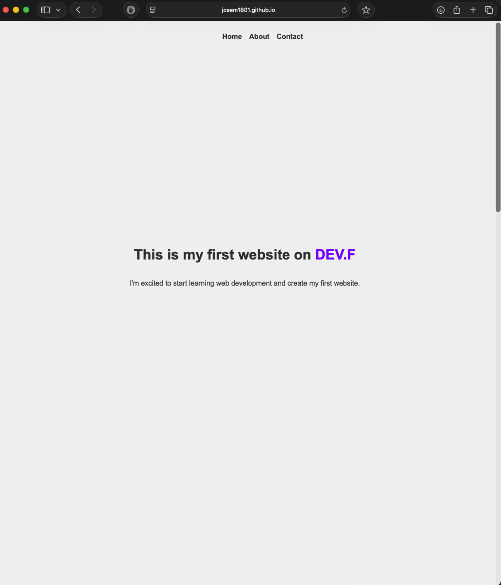
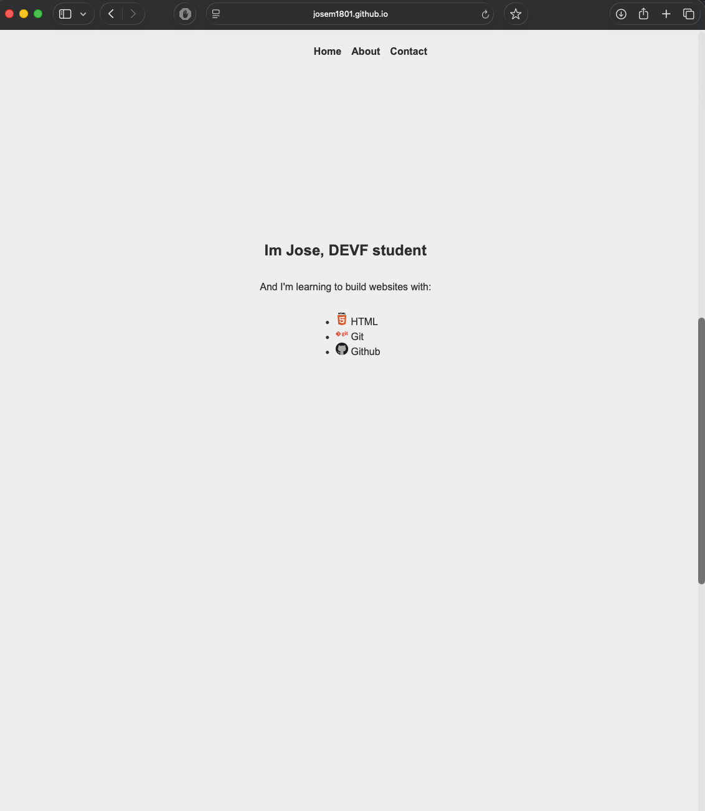
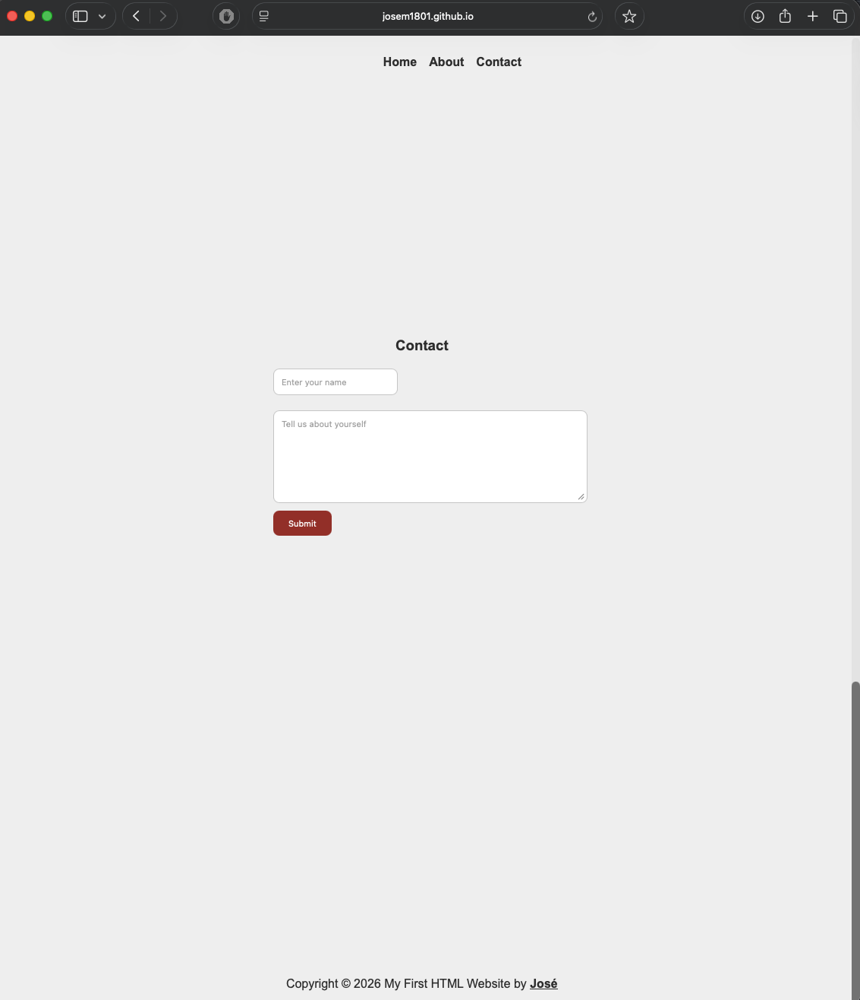

# EVIDENCIAS

## Capturas de pantalla

1. **Settings → Pages** mostrando la URL activa:
   

2. **Sitio abierto en el navegador:**
   
   
   

## Aprendizajes

1. **¿Qué fue lo más fácil y lo más retador?**
   - Lo más fácil: Investigar y verificar que el HTML fuera semántico
   - Lo más retador: Hacer que el sitio web se viera estéticamente bien

2. **¿Qué etiquetas semánticas usaste y por qué?**
   - Respuesta: Utilice una llamada section para separar por secciones mi pagina en lugar de utilizar div's

3. **¿Cómo organizaste tus commits?**
   - Respuesta: Los organice utilizando una palabra clave al inicio que me permite diferencias entre cambios grandes, estilos o errores

4. **¿Qué mejorarías en la siguiente iteración?**
   - Respuesta: Agregar meta tags para que mis links se vean mejor al compartirlos
